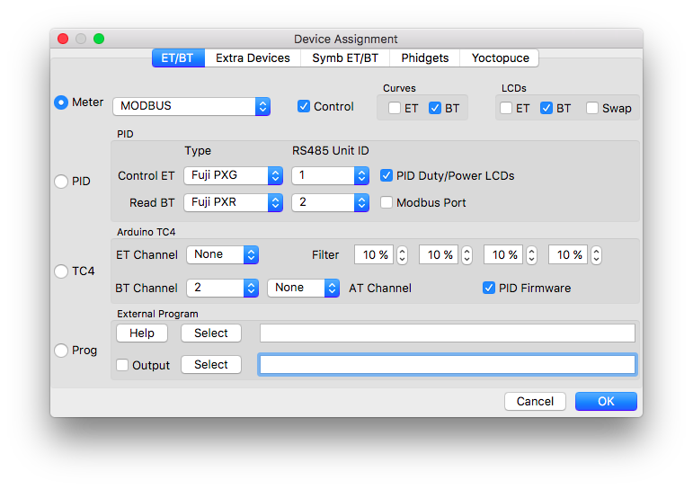
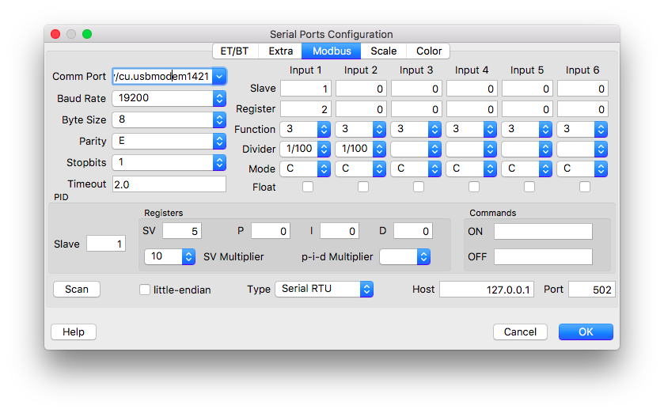
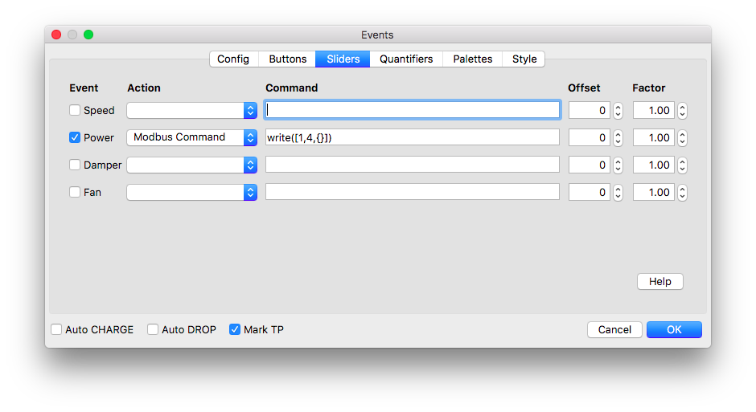
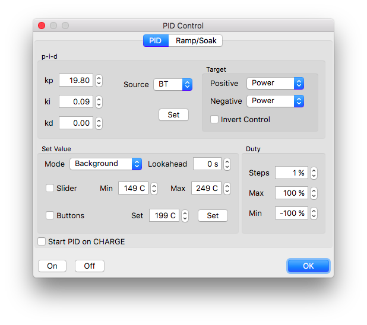
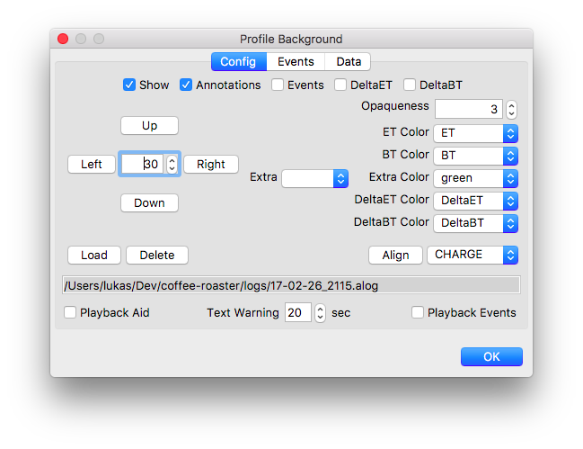

# Arduino Controlled Coffee Roaster {#arduino-controlled-coffee-roaster}

This repo contains a sketch for interfacing an
Arduino with [Artisan](https://github.com/artisan-roaster-scope/artisan) RoasterScope. You can use this software to modify a popcorn popper into a computer controlled coffee roaster!

## Parts {#parts}
This setup is designed to be extremely low budget. The parts you will need are:

- [Arduino](https://www.arduino.cc/en/main/arduinoBoardUno): I used an Arduino Uno
- [MAX6675 Thermocouple with Breakout](https://www.aliexpress.com/item/MAX6675-Module-K-Type-Thermocouple-Thermocouple-Sensor-for-Arduino-AL/32278773562.html): $3.96 CAD on AliExpress. The Arduino uses this to read the temperature during roasting. Coffee roasting temperatures are around 180°C – 240°C so make sure your thermocouple is rated high enough to handle this.
- [Solid State Relay](https://www.aliexpress.com/item/FREE-SHIPPING-Industrial-FOTEK-Solid-State-Relay-SSR-40A-with-Protective-Flag-SSR-40DA-40A-DC/2035173599.html): I used a 40A SSR for controlling the heating element. 40A is probably overkill, but you probably shouldn't use one less than 25A depending on the wattage of your popcorn popper.
- MOSFET Transistor: The Arduino digital pins didn't have enough power to control the relay, so I used a mosfet transistor between the digital pin and relay. This might not be an issue depending on your relay though.
- Tape, Wires, Breadboard, Solder, etc..
- And most importantly: Green Coffee Beans! I've been using beans from a local coffee roaster, but if you want to buy some online you can check out [Sweet Maria's](https://www.sweetmarias.com/)

## Wiring {#wiring}

First, follow the instructions [here](https://ineedcoffee.com/west-bend-popper-2-rewire-coffee-roasting/) to separate the main heating element of your popper from the rest of the popper's circuitry. Now, you can plug the thermocouple breakout directly into the Arduino's pins 2->6. Using the breadboard wire up a circuit so that the digital pin 9 controls the MOSFET which controls the circuit going through the control line on the SSR. Then connect the other end of the SSR to the heating element circuit as shown below:

That should be everything you need for wiring. If something isn't working, it might be a good idea to troubleshoot circuits using an LED or multimeter. Also, please be extremely careful whenever working with the 120v circuitry of the popcorn popper.

## Arduino Setup {#arduino-setup}

To setup the Arduino, simply upload the sketch using the Arduino IDE. You will need to add the [MAX6675 library](https://github.com/adafruit/MAX6675-library) and the [ModbusRTU](https://github.com/4-20ma/ModbusMaster) library. You can install both of these using the [Arduino Library Manager](https://www.arduino.cc/en/Guide/Libraries#toc3).

## Modbus {#modbus}
Modbus is a serial communication protocol used in lots of industrial equipment, including many industrial coffee roasters. This project uses Modbus so that the Arduino can easily interface with Artisan RoasterScope software as well as any commercial coffee roasting software that supports the Modbus protocol.

The default sketch settings set up a slave at address 1. The temperature is published to register 2, and to control the heating element, we can update register 4. The heating element reads a value in the range 0<=n<=99.

## Artisan Config {#artisan-config}
To configure Artisan RoasterScope, first set up the device under Config->Device:

Then, click ok. Now Artisan will ask for the serial port settings. Enter them as follows, replacing comm port with the port your arduino is on:

Finally, we need to configure a slider to control the heating element. Under Config->Events, select the Sliders tab and set up a slider for the heating element:

## PID Control {#pid-control}

"A proportional–integral–derivative controller (PID controller) is a control loop feedback mechanism (controller) commonly used in industrial control systems. A PID controller continuously calculates an error value e(t) as the difference between a desired setpoint and a measured process variable and applies a correction based on proportional, integral, and derivative terms (sometimes denoted P, I, and D respectively) which give their name to the controller type." - Wikipedia

Artisan can be configured to control the heating slider using a PID controller. To enable PID control, first check the box Control in Config->Device. Then click the blue control button on the main screen, and enter settings as follows:

 

 You might want to play with the kp, ki, and kd constants, although tuning PID controllers still seems like a dark art to me. You can also check out [this page](https://innovativecontrols.com/blog/basics-tuning-pid-loops) for some tips on tuning these parameters.

 Now, follow the steps below to load a roasting profile. During a roast, if you click the blue control box, the PID control will take over the slider and try to match the background roast profile as closely as possible.

## Loading a Roasting Profile {#loading-a-roasting-profile}

To load a background roast, go to Roast->Background and click the load button:

 

 You can also play with some of the parameters to sync up the background profile with your roast. To design a profile from scratch, you can open the designer tools at Tools->Designer.

## Tips {#tips}
If you live in a cold climate, such as Canada (where I'm from) it will be difficult for the roaster to reach high enough temperatures outside. A tip I learned [here](https://ineedcoffee.com/winter-home-roasting/) is to place the roaster in a box, so that the hot air being dispelled from the roaster is fed back into the air intake. This will help improve your roasts during winter.
